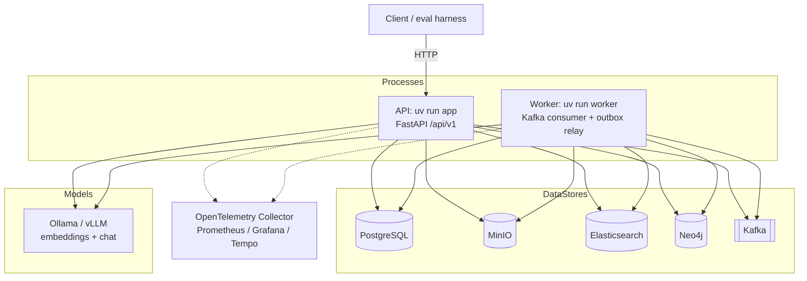
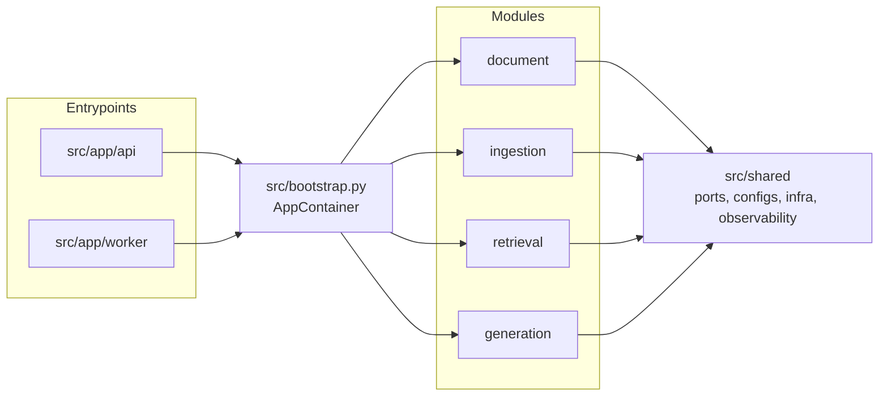
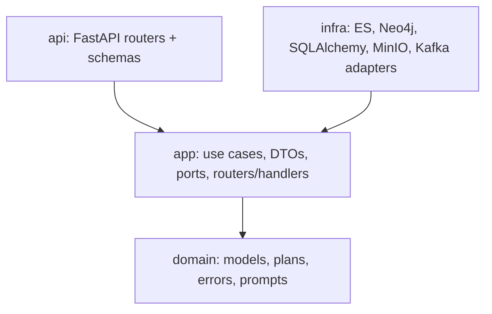
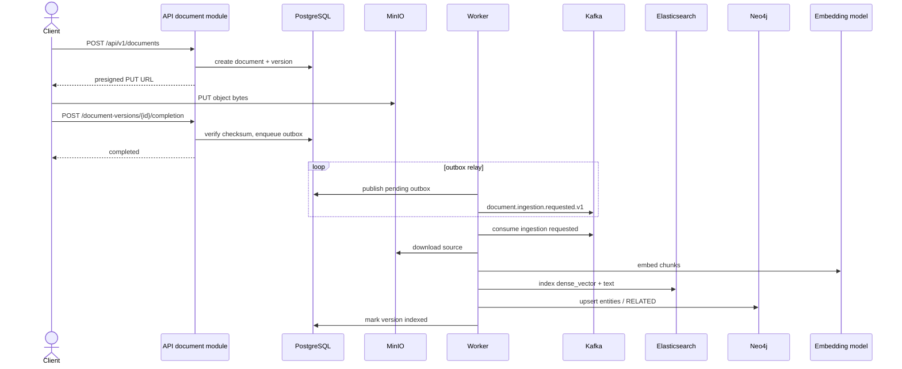
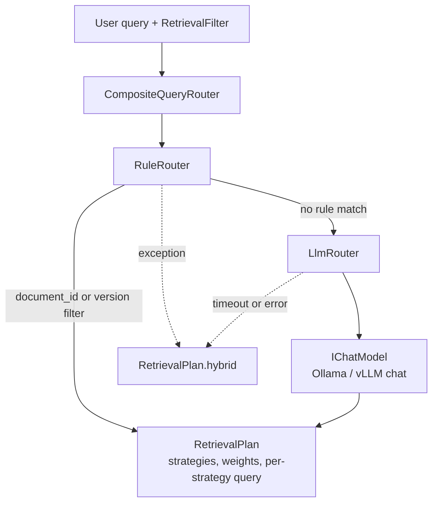
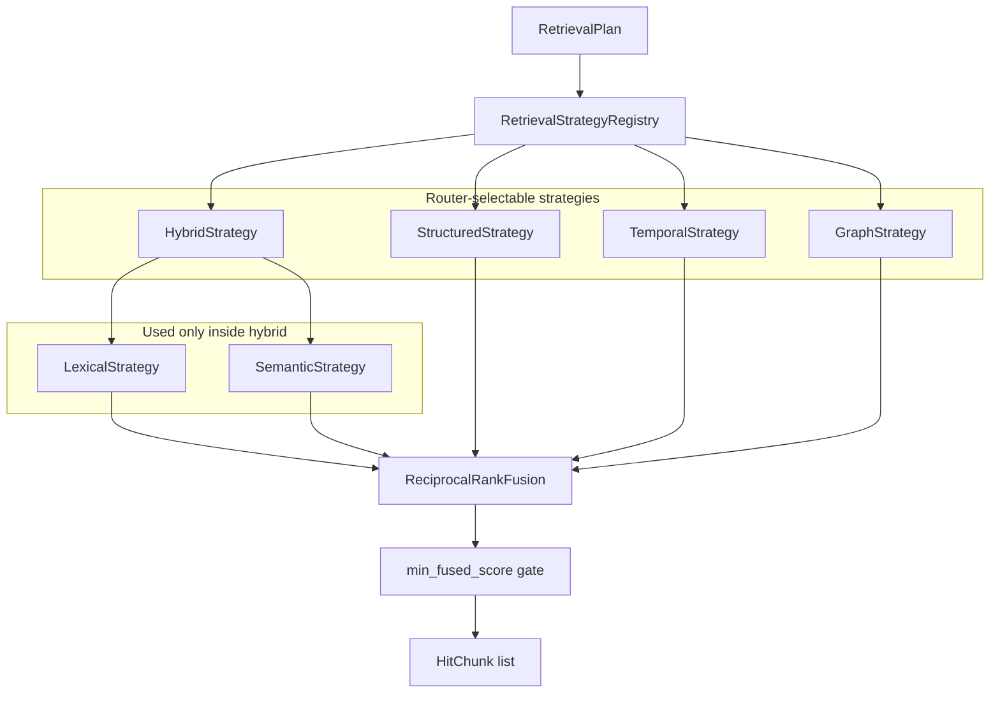
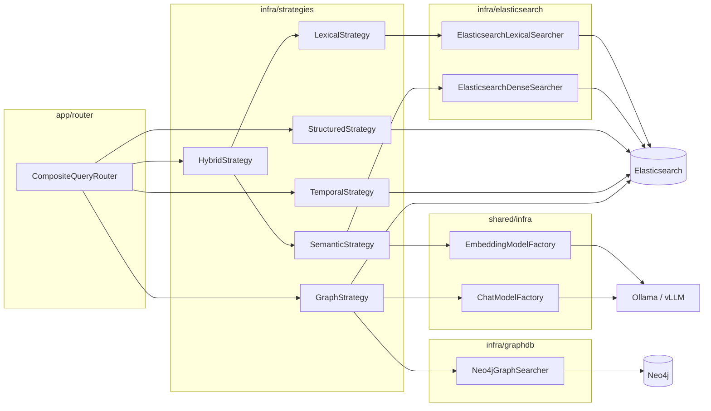
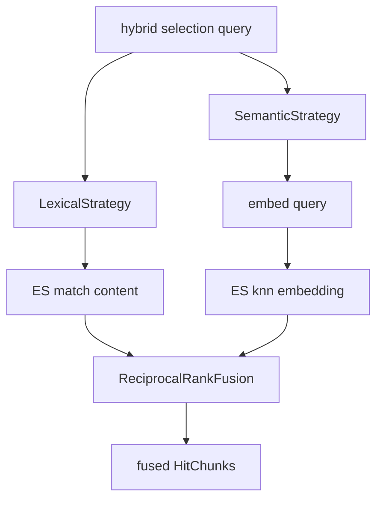
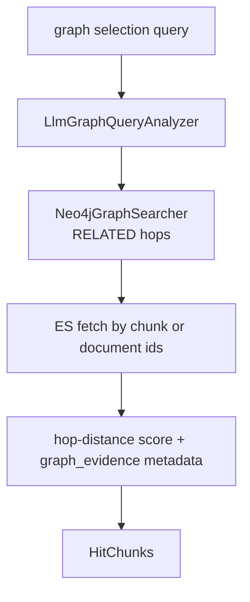
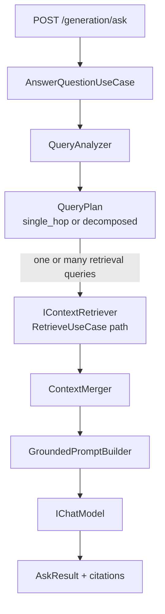

# RAG System

Modular RAG platform with a FastAPI API process, a Kafka ingestion worker, hybrid
retrieval (BM25 + dense + GraphRAG), and grounded answer generation. Modules follow
Clean Architecture boundaries (`api` / `app` / `domain` / `infra`) under
`src/modules/{document,ingestion,retrieval,generation}`, wired by
`src/bootstrap.py`.

## Contents

- [Setup](#setup)
- [Running](#running)
- [Testing](#testing)
- [Evaluation](#evaluation)
- [Retrieval strategies](#retrieval-strategies)
- [API documentation](#api-documentation)
- [Observability and dashboards](#observability-and-dashboards)
- [File size / SHA-256 for the upload API](#file-size--sha-256-for-the-upload-api)
- [Architecture](#architecture)
  - [System context](#system-context)
  - [Module layout](#module-layout)
  - [Clean Architecture layers](#clean-architecture-layers)
  - [Document upload and async ingestion](#document-upload-and-async-ingestion)
  - [Query router](#query-router)
  - [Retrieval strategies and infra](#retrieval-strategies-and-infra)
  - [Hybrid and graph detail](#hybrid-and-graph-detail)
  - [Generation ask path](#generation-ask-path)
  - [HTTP surface](#http-surface)

## Setup

```bash
conda env create -f environment.yaml   # first time only
conda activate rag-sys
```

## Running

```bash
make docker-up         # essentials only (Postgres, MinIO, ES, Kafka, Neo4j)
make docker-up-ollama  # Ollama + model pull/warmup
# optional: make docker-up-ui   # Kibana + Kafka UI (docker-compose.ui.yml)
# optional: make obs-up        # Grafana / Tempo / Prometheus / Langfuse
uv run app       # or: uv run dev (auto-reload); warms embed+chat on startup
uv run worker
```

## Testing

```bash
make test              # fast unit tests, mocked/faked infra, no Docker required
make test-integration  # real Postgres/Elasticsearch/Neo4j via Testcontainers, needs Docker
```

## Evaluation

```bash
uv sync --group evaluation  # one-time per clone
make docker-up
make eval-prepare  # download -> process -> ingest -> datasets/manifest.json
make eval-run       # score retrieval against the dev split
```

See [`datasets/README.md`](datasets/README.md) for the dataset, the manifest, and the id mapping,
and [`scripts/evaluation/`](scripts/evaluation) for the harness itself.

## Retrieval strategies

The query router (`src/modules/retrieval/app/router/`) picks one or more of these per query;
see `src/modules/retrieval/infra/strategies/`. `lexical` (BM25) and `semantic` (dense vector)
are not independently selectable - `hybrid` always runs both in parallel and
reciprocal-rank-fuses the results, since the two catch different failure modes on the same
query rather than serving different query types.

- **hybrid** - fused keyword (BM25) + semantic vector search. The default for ordinary
  content questions.
- **structured** - exact-match lookup by identifier fields (`chunk_id`, `document_id`,
  `document_version_id`, `metadata.filename`, `metadata.source`), or scoped content search
  when an explicit `document_id`/`document_version_id` filter is given.
- **temporal** - lexical search boosted by recency, decaying by `valid_from` age.
- **graph** - traverses entity relationships in Neo4j to find related chunks/documents, then
  scores Elasticsearch hits by hop distance.

Wiring and infra mapping: [Architecture - Retrieval strategies and infra](#retrieval-strategies-and-infra).

## API documentation

After starting the API with `uv run app` or `uv run dev`, open:

- Swagger UI (test endpoints): http://localhost:8000/docs
- ReDoc: http://localhost:8000/redoc
- OpenAPI schema: http://localhost:8000/openapi.json

## Observability and dashboards

Full dashboard list, key Grafana panels, and the trace-span reference live in
[`deployments/observability/README.md`](deployments/observability/README.md). Quick links once
`make obs-up` / `make docker-up-ui` are running:

- Grafana: http://localhost:3001 (`make obs-up`)
- Langfuse LLM analytics: http://localhost:3002 (`make obs-up`)
- GraphDB (Neo4j Browser): http://localhost:7474 (`neo4j` / `rag-sys-dev`; included in `make docker-up`)
- Kafka UI (Kafbat): http://localhost:8082 (`make docker-up-ui`)
- Kibana: http://localhost:5601 (`make docker-up-ui`)

## File size / SHA-256 for the upload API

Bash:

```bash
stat -c%s ./file.pdf
sha256sum ./file.pdf | cut -d' ' -f1
```

PowerShell:

```powershell
(Get-Item .\file.pdf).Length
(Get-FileHash .\file.pdf -Algorithm SHA256).Hash.ToLower()
```

## Architecture

### System context

Two long-running processes share the same `AppContainer` composition root
(`src/bootstrap.py`). The API serves HTTP; the worker consumes
`document.ingestion.requested.v1` (DLQ on failure) and optionally relays the
transactional outbox to Kafka.



### Module layout

Feature modules live under `src/modules/`. Entrypoints only talk to the composition root.



### Clean Architecture layers

Same layering inside every feature module. Dependency direction is inward; infrastructure
implements application ports.



| Layer | Typical paths |
|-------|----------------|
| api | `src/modules/*/api/router.py` |
| app | `src/modules/*/app/use_cases/`, `app/router/`, `app/ports.py` |
| domain | `src/modules/*/domain/` |
| infra | `src/modules/*/infra/`, `src/shared/infra/` |

### Document upload and async ingestion

Happy path: create upload URL → client PUT to MinIO → complete upload (outbox row) →
worker relays outbox to Kafka → ingestion handler chunks, embeds, writes ES + Neo4j.



Also available: `POST /api/v1/ingestions` (request ingestion use case). Eval prepare calls
`IngestDocumentUseCase` in-process and skips Kafka.

### Query router

`RetrieveUseCase` always starts with `CompositeQueryRouter`
(`src/modules/retrieval/app/router/`). Rules win when they match; otherwise the LLM router
classifies once into a `RetrievalPlan`. On router failure the plan falls back to `hybrid`.



| Router | Code | Behavior |
|--------|------|----------|
| `RuleRouter` | `app/router/rules.py` | If `document_id` / `document_version_id` filter is set, force `structured` |
| `LlmRouter` | `app/router/llm_router.py` | Single structured chat completion; may select hybrid / structured / temporal / graph |
| `CompositeQueryRouter` | `app/router/composite.py` | Rule first, then LLM, else hybrid fallback |

`lexical` and `semantic` are **not** router targets; only `hybrid` exposes them (see below).

### Retrieval strategies and infra

`RetrievalComponentFactory` (`src/modules/retrieval/__init__.py`) registers strategies and
wires each to concrete searchers / stores. Selected strategies run in parallel; multiple
lists are fused with `ReciprocalRankFusion`, then an optional fused-score gate.



Strategy → infrastructure map (from factory wiring):

| Strategy | App / infra types | External systems |
|----------|-------------------|------------------|
| `hybrid` | `HybridStrategy` + `LexicalStrategy` + `SemanticStrategy` + `ReciprocalRankFusion` | Elasticsearch text + knn; embedding model for query vector |
| `lexical` (internal) | `ElasticsearchLexicalSearcher` | Elasticsearch `match` on `content` |
| `semantic` (internal) | `IEmbeddingModel` + `ElasticsearchDenseSearcher` | Ollama/vLLM embed; Elasticsearch `knn` on `embedding` |
| `structured` | `StructuredStrategy` | Elasticsearch term / filtered content lookup |
| `temporal` | `TemporalStrategy` + routing half-life settings | Elasticsearch lexical + `valid_from` recency decay |
| `graph` | `GraphStrategy` + `LlmGraphQueryAnalyzer` + `Neo4jGraphSearcher` | Chat model for entity anchors; Neo4j `RELATED*0..hops`; Elasticsearch fetch by chunk/doc ids |



### Hybrid and graph detail

**Hybrid** always runs BM25 and dense retrieval concurrently, then RRF-fuses them. That is
why the router never selects `lexical` or `semantic` alone.



**Graph** extracts entity names with the chat model, walks Neo4j relationships, then loads
chunk text from Elasticsearch and scores by hop distance.



### Generation ask path

`POST /api/v1/generation/ask` uses `AnswerQuestionUseCase`: optional complex query analysis
(multi-intent), retrieval fan-out via `IContextRetriever` (same retrieval stack), context
merge, then grounded completion with citations.



This is a fixed LLM-orchestrated pipeline (plan then retrieve then answer), not an
open-ended agent tool loop.

### HTTP surface

| Method | Path | Module |
|--------|------|--------|
| `GET` | `/health` | API shell |
| `POST` | `/api/v1/documents` | document |
| `POST` | `/api/v1/document-versions/{id}/completion` | document |
| `POST` | `/api/v1/ingestions` | ingestion |
| `POST` | `/api/v1/retrieval/search` | retrieval |
| `POST` | `/api/v1/generation/ask` | generation |

Diagram verification: Mermaid docs checked
([flowchart](https://mermaid.js.org/syntax/flowchart.html),
[sequence](https://mermaid.js.org/syntax/sequenceDiagram.html)).
UNVERIFIED: render not checked in this environment - preview in GitHub or Mermaid Live Editor.
